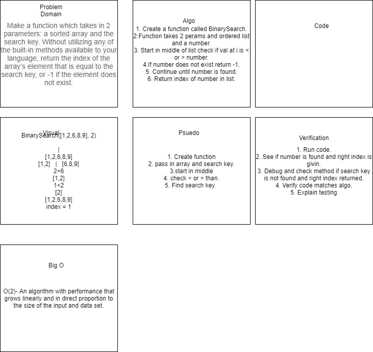

# Challenge Summary

Make a function that takes iun two parameters: a sorted array and the search key.
Return the index of the arrays element that is equal to the search key, or -1 if the element doesn't exist.

## Challenge Description

1. create a function
2. pass in an array and search key
3. check < or >
4. find search key by halving array.

## Approach & Efficiency

O(2)- An algoithum with performance that grows linearly and in direct porportion to the size of the data set.
Complexity is fair

## Solution

[Array Shift Code](../array_binary_search.py)

## Collaborators

[Sam Clark](https://github.com/samuelclark907)
