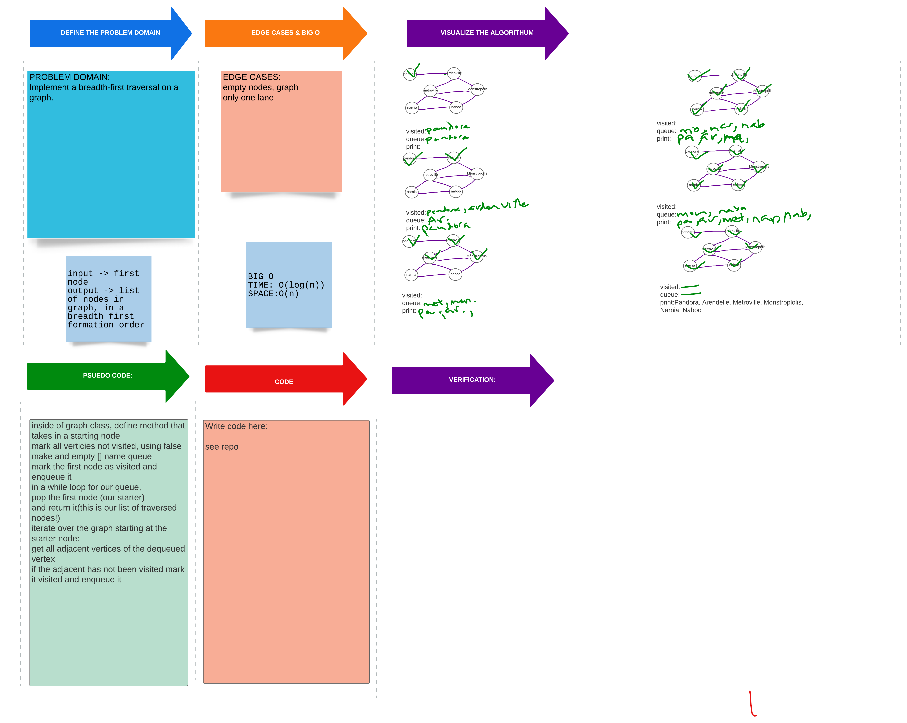

# Breadth First Graph

## Challenge

- [x] Implement a breadth-first traversal on a graph.

-[x] Extend your graph object with a breadth-first traversal method that accepts a starting node and return a collection of nodes in the order they were visited. 

-[x] Display the collection.

## Approach & Efficiency

> Mark visited verticies so we don't repeat during our search.

BIG O
TIME: O(log(n))- medium traversal of operations vs. elements in the operation
SPACE: o(n)- space complexity fair.

## Solution

[Breadth First graph Code](../breadth_first/breadth_first.py)

[PR for Breathdth First Graph]()