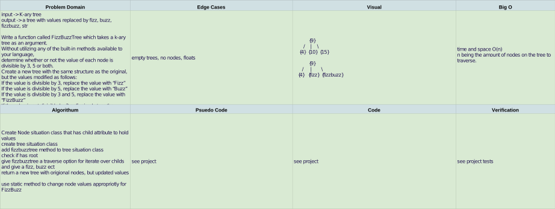

# Fizz Buzz

## Challenge

    [x] Write a function called FizzBuzzTree which takes a k-ary tree as an argument.
    [x] Without utilizing any of the built-in methods available to your language, determine whether or not the value of each node is divisible by 3, 5 or both. 
    [x] Create a new tree with the same structure as the original, but the values modified as follows:
    [x] If the value is divisible by 3, replace the value with “Fizz”
    [x] If the value is divisible by 5, replace the value with “Buzz”
    [x] If the value is divisible by 3 and 5, replace the value with “FizzBuzz”
    [x] If the value is not divisible by 3 or 5, simply turn the number into a String.
    [x] Return a new tree.

## Approach & Efficiency

Write tests to prove the functionality from the challenge.

## Solution

[PR for FizzBuzz](https://github.com/NyxofDarkness/data-structures-and-algorithms/pull/47)