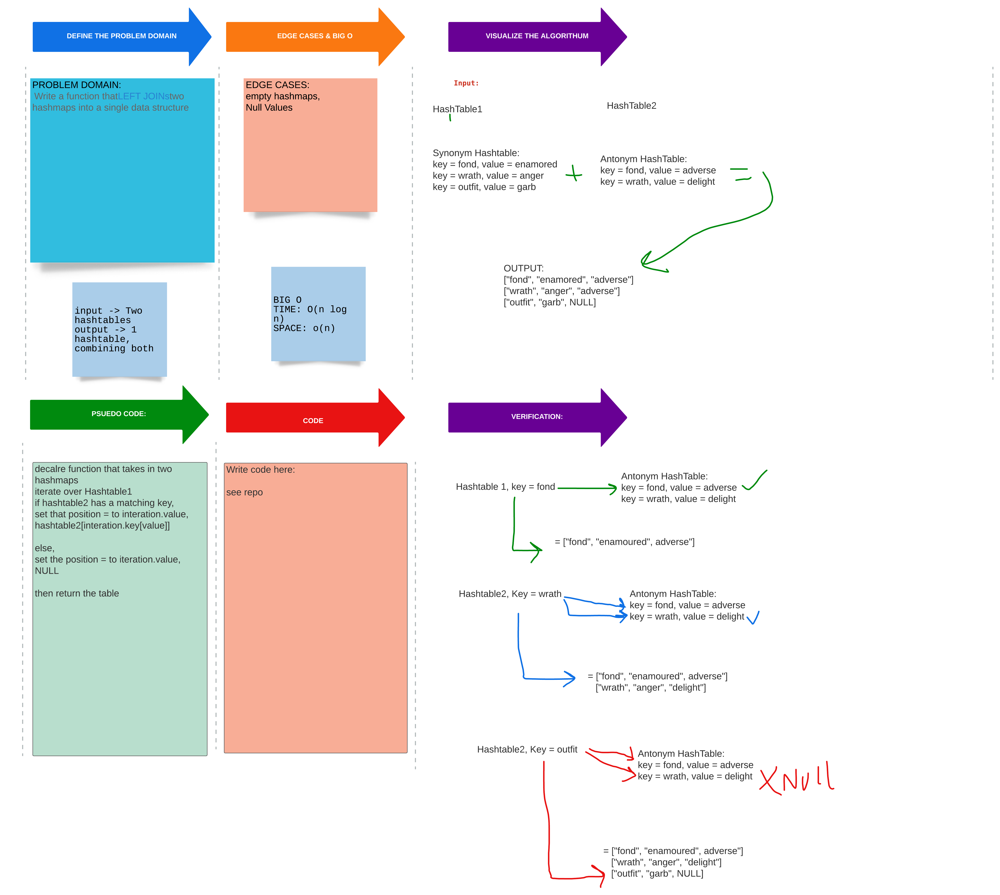

# Left Join

## Challenge

- [x] Write a function that LEFT JOINs two hashmaps into a single data structure.

-[x] The first parameter is a hashmap that has word strings as keys, and a synonym of the key as values.

-[x] The second parameter is a hashmap that has word strings as keys, and antonyms of the key as values.

-[x] Combine the key and corresponding values (if they exist) into a new data structure according to LEFT JOIN logic.

## Approach & Efficiency

BIG O
TIME: O(n log n)- We must iterate over first hashtable, and iterate through second comparing the values
SPACE: o(n)- Not much, two table turns into one.

## Solution

[Left Join Code](../left_join/left_join.py)

[PR for Left Join](https://github.com/NyxofDarkness/data-structures-and-algorithms/pull/55)