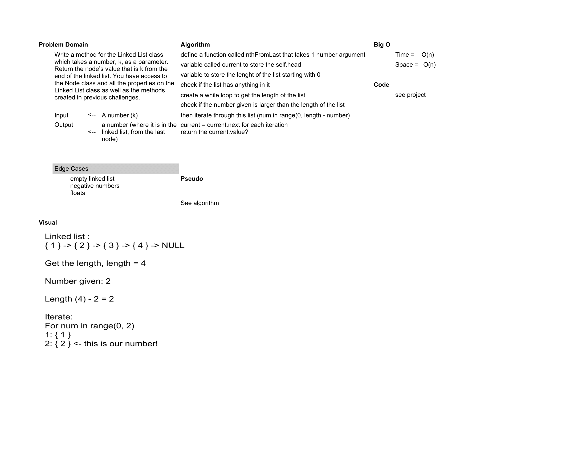

# Singly Linked Lists

Create a Node class that has properties for the value stored in the Node, and a pointer to the next Node.

## Challenge

> Within your LinkedList class, include a head property. Upon instantiation, an empty Linked List should be created.

> Define a method called insert which takes any value as an argument and adds a new node with that value to the head of the list with an O(1) Time performance.

> Define a method called includes which takes any value as an argument and returns a boolean result depending on whether that value exists as a Node’s value somewhere within the list.

> Define a method called __str__ which takes in no arguments and returns a string representing all the values in the Linked List, formatted as:
"{ a } -> { b } -> { c } -> NULL"

> Any exceptions or errors that come from your code should be semantic, capturable errors. For example, rather than a default error thrown by your language, your code should raise/throw a custom, semantic error that describes what went wrong in calling the methods you wrote for this lab.

> Write a method for the Linked List class which takes a number, k, as a parameter. Return the node’s value that is k from the end of the linked list. You have access to the Node class and all the properties on the Linked List class as well as the methods created in previous challenges.

## Approach & Efficiency

BigO:

Time:O(1)
Time is linear
Space:O(n)
Linear, one line problem

BigO for Knth NUmber:

time & space O(n)

## Solution

[Linked List Code](../linked_list.py)

Worked with:

[Anthony Beaver](https://github.com/PyDrummer)

[Amber Falbo](https://github.com/AmberFalbo/AmberFalbo)

[Kim Damalas](https://github.com/kimmyd70)

[Robert Carter](https://github.com/racarter1215)

[PR URL](https://github.com/NyxofDarkness/data-structures-and-algorithms/pull/35)

[PR for Knth](https://github.com/NyxofDarkness/data-structures-and-algorithms/pull/37)