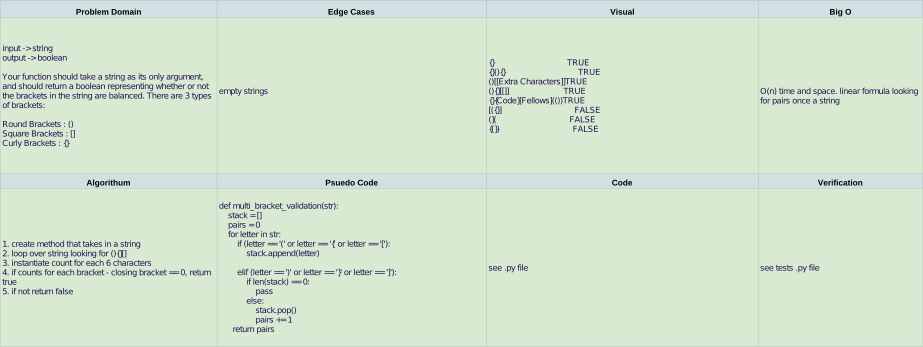

# Challenge Summary


## Challenge Description

Your function should take a string as its only argument, and should return a boolean representing whether or not the brackets in the string are balanced. There are 3 types of brackets:

> Round Brackets : ()

> Square Brackets : []

> Curly Brackets : {}

Example

```Input```	```Output```

{}	TRUE

{}(){}	TRUE

()[[Extra Characters]]	TRUE

(){}[[]]	TRUE

{}{Code}[Fellows](())	TRUE

[({}]	FALSE

(](	FALSE

{(})	FALSE

## Approach & Efficiency

BigO = O(n) both time and space. linear solve.
Complexity is fair

## Solution



[Multi Bracket Validation Code](../multi_bracket_validation.py)

## Contributions

[PR]()
