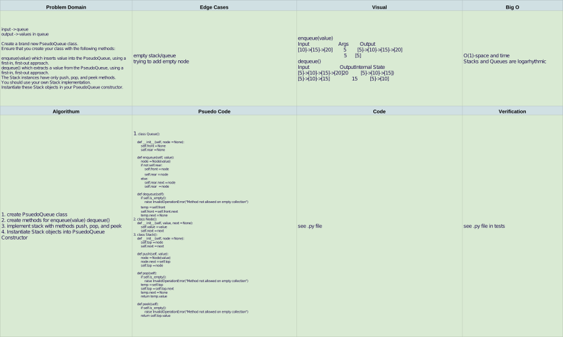

# queues-with-stacks

## Challenge

Create a brand new PseudoQueue class.
Ensure that you create your class with the following methods:

enqueue(value) which inserts value into the PseudoQueue, using a first-in, first-out approach.
dequeue() which extracts a value from the PseudoQueue, using a first-in, first-out approach.
The Stack instances have only push, pop, and peek methods.
You should use your own Stack implementation.
Instantiate these Stack objects in your PseudoQueue constructor.

## Approach & Efficiency

> PsudoQueue is instantiated with our stack(first, second) in the constructor. First and Second each have push, pop, and peek methods

> enqueue: checks the rear of queue, starts a node if empty, otherwise creates new rear node. 

> dequeue: raises exception if empty, otherwise sets temp node to front, adds next to that, and create a None for the temp.next then returns temp.value

## Solution

[PR for queues with stacks: ]()