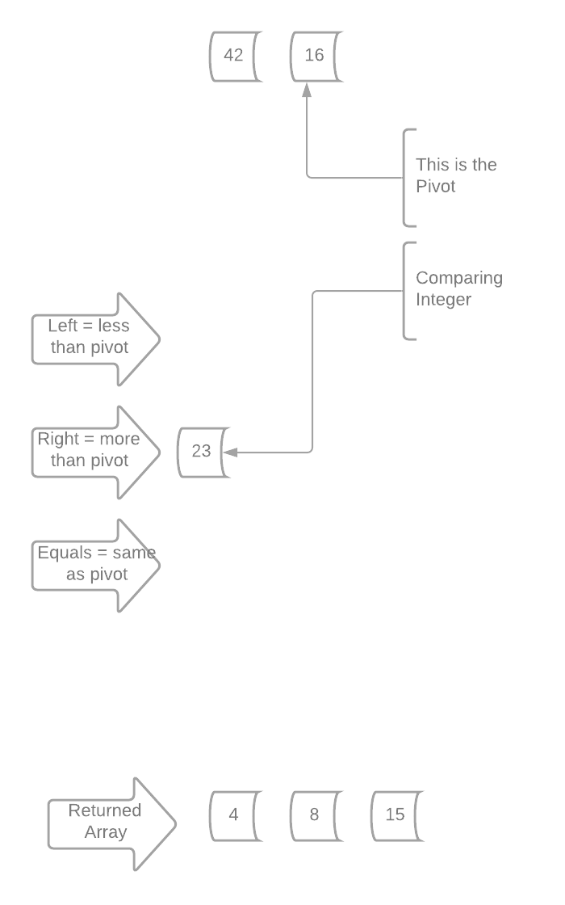
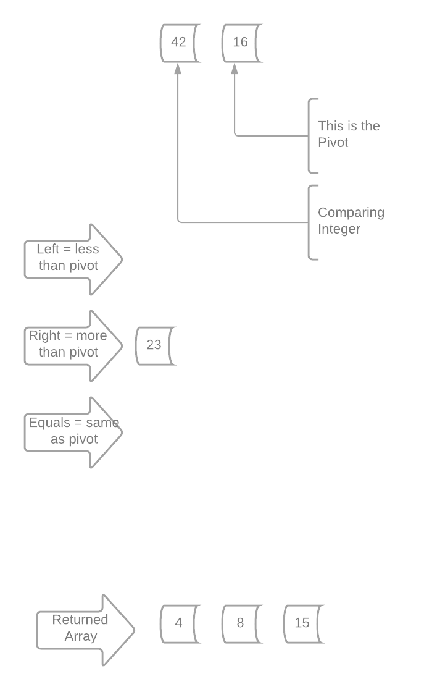

# Writing Python Code To Sort By Merging

**Quick_sort is like a set of scales. We find a pivot point, and sort the remaining array based on whether the number is less, greater than or equal to our pivot point. Each side is then continually sorted, and only when every number in the given array has been equal to a pivot point, do we get a returned array, Sorted of course!**

## Let's go through the Solution:

> As we first look at the solution, you will see us set up three empty lists to hold our array as we sort through it. This is important to keep us organized.

``` python
	left = []
	equal = []
	right = []
```

> Now, if the length of the array is less than or equal to one, we just return the array. This comes in handy later!

``` python
	if len(arr) <= 1:
		return arr
```

> When we find our array having more than one, we are going to take the last index in it's length and set it as our pivot number.

``` python
	if len(arr) > 1:
		pivot = arr[-1]
```


> For each position in our array (we call this nums) we need to compare three things. So the code first grabs the first index position and sets it to nums, to be our comparing integer.

``` python
    # get the integers one at a time
	for nums in arr:
```


> Our first if statement asks if nums is less than our pivot integer. In this case it 8 is less than 15, so we will append nums to the variable left.

``` python
	if nums < pivot:
        left.append(nums)
```


> We still have nums left in our array, so 4 becomes our new comparing integer (nums)


> It's also less than 8, so let's append it to the left variable.


> Back at the start, we now are comparing 23 to our pivot. Since that one ISN'T less than the pivot, we must go on through our options!


``` python
elif nums == pivot:
	equals.append(nums)
elif nums > pivot:
	right.append(nums)
```

> 23 is not equal to our pivot integer, so we move on. It IS greater than the pivot so the solution will append 23 to the right variable.

> For the sake of time, let's finish up! All the nums are ran through the options, appending to their correct positions. Lastly, the pivot number (at the end of our array as you remember) is appended to the equals variable!


> In this last bit of code, Important things happen. This is how we populate our sorted array! 

``` python
# This is sending the left and right variable backs through quick_sort, and returns equal as it is in the middle.
return quick_sort(left) + equals + quick_sort(right)
```

> Remember, the solution works like a scale. The pivot is in the middle, and the greater and lesser numbers are sorted left and right.

> The return sends the variables back through the quick_sort until all nums have been a pivot.

>Since those pivots end up being appended into the equals variable, those are just returned as is, in the order they are recieved. For this first round, that is only 15.

**Let's see how this works!**

> Notice, in the return we ALWAYS deal with the left first, and work our way through the statement.

> So let's take our 8 and 4 and run them through quick_sort.


> Pretty easy, this array is more than 1 in length, so 4 is make the pivot and 8 is what we compare. 


> When we hit that return again, it does the same thing as before, but this time we have only two numbers to compare! 

> In the first return quick_sort(left), we can replace that with 4, 8. 

> The solution now starts working with that right variable, setting a pivot and working along the nums.

> NOTE: Check out our current returned array as quick_sort(left) + equals are completed!


> Since 23 is more than the pivot of 16, it is placed in the right variable.



> 42 is now the comparing Integer(nums)



> Since it is more than the pivot, it too is placed in the right variable, and the pivot is appended to the equals, since it equals itself!


> Again, we hit that return. The left variable is sent into quick_sort. Since it is more than 1, 42 is set to the pivot, and 23 is compared. 


> 23 goes to the left variable, and 42 to the equals. 

> This return is so much easier. The left no longer passes the more than 1 rule, so it returns the array, in our case the 23. 

> and 42 is returned in the equals variable. 

> Remember we are returning a quick_sort within a quick_sort, withing another! This is great, as the numbers stay in order based on whether they are smaller or greater than the pivot. 


> Think of it this way: It's a nested set of sorts! Here is a visual for the return, note the green dots are the numbers FINALLY returned!


> Thank you for coming to my quick_sort Ted Talk.