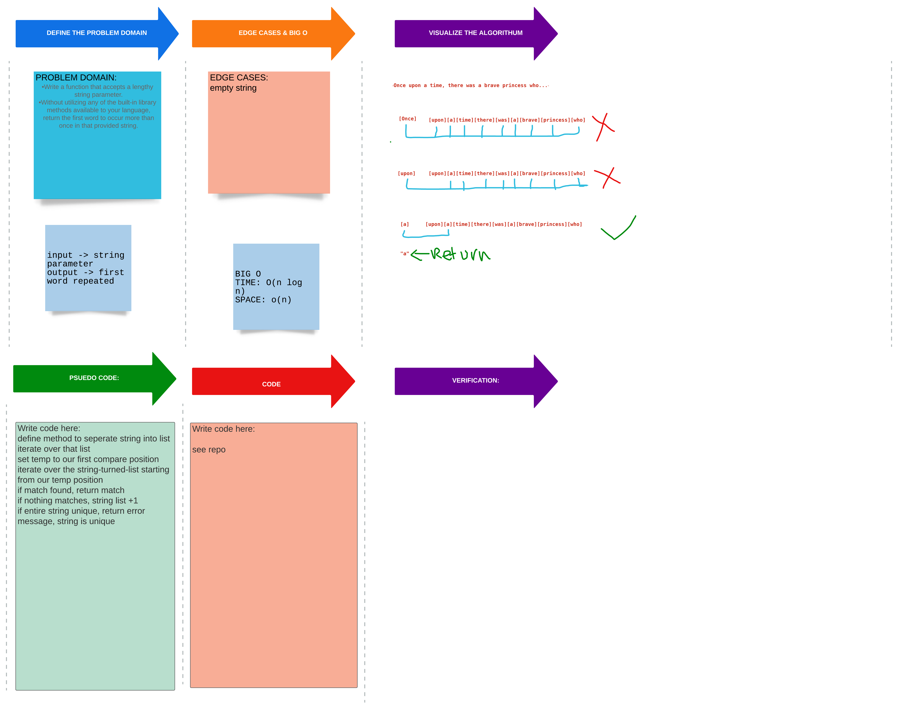

# Hash Table

## Challenge

-[x] Write a function that accepts a lengthy string parameter.

-[x] Without utilizing any of the built-in library methods available to your language, return the first word to occur more than once in that provided string.

-[x] write tests for each method used

## Approach & Efficiency

I want to define method to seperate a string into list
I want to iterate over that list, setting a temp variable to hold the position we are comparing.
I want to iterate over the string-turned-list starting from our temp position
if I find a match, I will return match
if nothing matches, we will set our temp vaiable to the next iteration
if entire string is unique, I will return an error message, string is unique

## Solution

[Repeated Word](/home/nyx/projects/codefellows/data-structures-and-algorithms/python/repeated_word/repeated_word.py)

[PR for Repeated Word](https://github.com/NyxofDarkness/data-structures-and-algorithms/pull/52)

## Contributions

[.string from stack overflow](https://stackoverflow.com/questions/4371231/removing-punctuation-from-python-list-items)