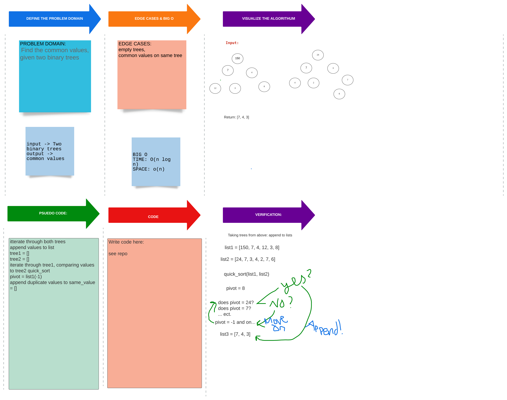

# Tree Intersection

## Challenge

-[x] Write a method called tree_intersection that takes two binary tree parameters.

-[x] Find common values in 2 those two binary trees.

## Approach & Efficiency

## Solution

[Tree Intersection Code](/home/nyx/projects/codefellows/data-structures-and-algorithms/python/hashtable/hashtable.py)

[PR for tree intersection](https://github.com/NyxofDarkness/data-structures-and-algorithms/pull/51)